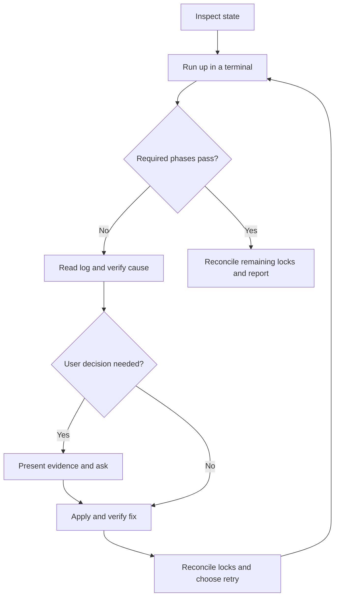

# Supervised up

Own the update from launch through verified completion. A fixed component is
progress, not the end of the task.
For an explanation or review without execution, answer from source and run no update.

## Start and monitor

1. Check `command -v up dotfiles mise dhk`. Report a missing command before running an update.
2. Read `~/AGENTS.md`, `~/.config/mise/AGENTS.md` and `~/docs/system-platforms.md`.
   Read the owning subsystem guide before changing its files.
3. From the home work-tree, record `dotfiles status --short` and both lockfile diffs, including staged changes.
   Preserve unrelated changes. Reconcile a dirty lock before starting a normal update.
   Match existing lock changes to the failed run's log. Ask about ownership when that evidence is absent.
   Do not commit another task's lock changes to clear preflight.
4. Run `up` in an attached pseudo-terminal. With Codex's command runner, use `tty: true`.
   Tell the user to approve the macOS fingerprint prompt when it appears.
   Run sudo authentication and the update in the same terminal session when pre-authentication is needed.
   A separate terminal can have a separate sudo timestamp.
5. Keep the process session alive. Poll its output and inspect the log path printed by this invocation.
   Report progress at least once per minute. Quiet downloads and builds need log or process evidence before declaring a hang.

Start with normal `up` unless the user requests frozen mode or supplies an existing failure to continue.
Invocation authorises routine update work, fixes, checks and local commits throughout the loop.
Do not return with "rerun up" while you can run the retry yourself.

## Diagnose and fix

Read the failed phase's complete log section. The last twenty lines can hide the cause.
Record the failed phase, discriminating observation, repair and verification for each attempt.
Use the cheapest live observation that distinguishes the cause before editing.

| Observed failure | Next action |
| --- | --- |
| Mise refuses a replacement lock entry | Reproduce only that tool with verbose resolution. Inspect signature, platform and artifact errors. |
| Packslip signer changes | Verify the vendor workflow and release evidence. Present the identity change and ask before forgetting its pin. |
| PyPI or another registry times out | Check reachability, then retry the failed locked installs. Keep quarantine settings. |
| Homebrew cannot verify a bottle | Check credential availability and retry with attestation verification enabled. A plain successful install does not test verification. |
| Sudo is unavailable | Retry through an attached terminal so the user can authenticate. Do not change sudo policy to bypass authentication. |
| Pin audit reports an older installed binary | Compare `mise exec -- <tool> --version` with the shell's binary. An old PATH does not prove installation failed. |
| A declared app is discontinued | Check the cask's replacement and existing declarations before proposing removal or replacement. |

For new failures, inspect local source and live state, then check primary upstream sources where needed.
Make the smallest repair that resolves the observed cause. Verify it before retrying the pipeline.
Use project checks and hooks for tracked changes. Keep separate concerns in separate commits.

Ask only when progress requires a user decision, credential renewal or authentication.
Show findings before asking about signer changes, build-script approvals, quarantine exceptions,
compatibility, app replacement, destructive cleanup or OS installation.
Keep those decisions pending until answered. Reuse approval already given for the same action.

## Reconcile and resume

| Failed phase | Retry after verification |
| --- | --- |
| Mise resolution or installation | Finish `mise lock --global --bump` as needed, then `mise install --locked` and `mise lock --global --dry-run --json`. Check and commit the repaired lock. Run normal `up`. |
| Brew, APT, patches or flake update | Verify the failed operation and reconcile dirty locks. Run normal `up` so skipped update phases execute. |
| Rebuild after successful flake update | Run `up -s` against the existing inputs. It permits a dirty flake lock but requires a clean committed mise lock. |
| Commit or hook | Verify the intended diff and repair the hook failure. Commit only verified task paths, then resume according to the unfinished phase. |

Frozen mode skips standalone package updates, flake updates and lock commits.
Confirm successful earlier update phases from their log before choosing frozen recovery.
After a successful frozen rebuild, check and commit the flake lock left by the earlier update.
Never commit a flake update whose applicable rebuild still fails.
Match hk's config import version to the mise-selected binary when the update changes hk.
Use `mise exec --` for checks and commits when the session PATH retains older tools.

Retry while each attempt has a verified repair or evidence of a transient recovery.
An identical failure without new evidence needs a different investigation, not an unlimited command loop.
If progress requires the user or an unavailable service, state the exact blocker and the next observation needed.
Preserve logs and dirty locks. Do not call that outcome complete.

## Completion

Confirm exit status and required phase results. Normal success is `UPDATE COMPLETE (update)`.
Frozen success finishes this task only when it completes the remaining phases of an earlier normal update.
Account for any skipped required work and unresolved degradations before reporting completion.
Report fixes, commits, passed or skipped checks, and remaining advisories briefly.
Non-blocking CVEs, available macOS updates and pin-audit flags do not authorise unrelated upgrade work.

Regression scenarios live in [evals/scenarios.md](evals/scenarios.md).
Use them when revising this skill; they are not commands to run during an update.
