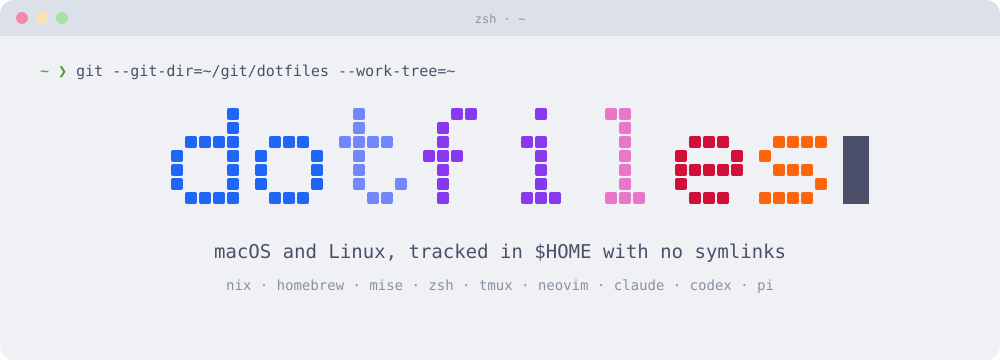
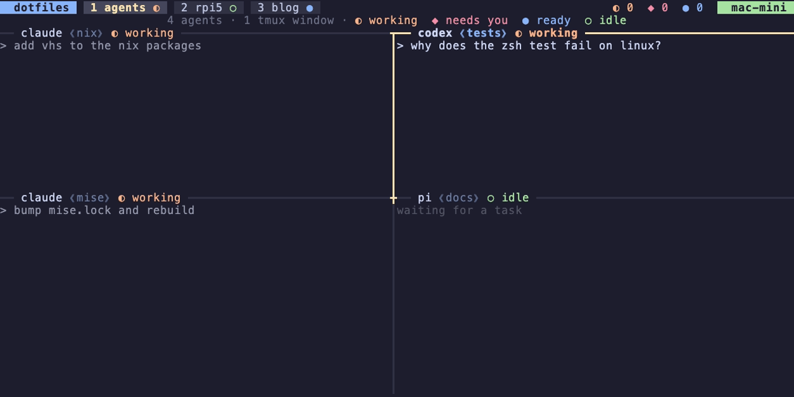

<p align="center">
  
</p>

# dotfiles

My macOS and Linux setup, tracked with git straight in `$HOME` with no symlinks.

```sh
curl -fsSL https://raw.githubusercontent.com/connorads/dotfiles/master/install.sh | bash
```

This bootstraps macOS, Linux or Codespaces. It targets my machines: users `connor`/`connorads` and the hosts listed in `install.sh`. To fork it, edit the host configs in [`flake.nix`](.config/nix/flake.nix) and the `VALID_DARWIN`/`VALID_HM` lists in `install.sh`. On a fresh machine, set `DARWIN_HOST` or `HM_HOST` to pick the config.

The stack is nix-darwin or home-manager for packages, Homebrew for macOS apps, mise for runtimes and hk for commit checks.

## Why

Symlink managers keep a second copy of the tree and break when a tool replaces a file. Here the git metadata lives in `~/git/dotfiles` and `core.worktree` points at `$HOME`, so tracked files are the real files. `~/.gitignore` ignores everything by default, so an existing home directory stays untouched until a path is un-ignored. Ahead-behind and push state work as normal in LazyGit.

## Use

```sh
dotfiles add .somefile    # after un-ignoring it in ~/.gitignore
dotfiles rm --cached .somefile
up                        # bump mise.lock and flake.lock, upgrade, rebuild
drs                       # rebuild macOS (darwin-rebuild switch)
hms                       # rebuild Linux (home-manager switch)
```

## Agents

Claude, Codex and pi run in tmux panes. Each window tab shows a state dot for its agents: ◐ working, ◆ needs you, ● ready, ○ idle.



## Docs

- [Setup: host selection, manual install, migration, your own repo from scratch](docs/setup.md)
- [System platforms: Nix targets, cleanup, sudo with YubiKey](docs/system-platforms.md)
- [`up`, mise and lockfiles](.config/mise/AGENTS.md)
- [Supply-chain controls](docs/supply-chain.md)
- [Commands](docs/commands.md)
- [Decision records](docs/adr/README.md)

## Credit

- [StreakyCobra on Hacker News](https://news.ycombinator.com/item?id=11071754), for avoiding symlinks with a bare repo
- [zwyx's blog post](https://zwyx.dev/blog/your-dotfiles-in-a-git-repo), for the Sublime Merge integration
- [Using a YubiKey for sudo via PAM](https://neilzone.co.uk/2022/11/using-a-yubikey-or-other-security-key-for-sudo-via-pam/)
