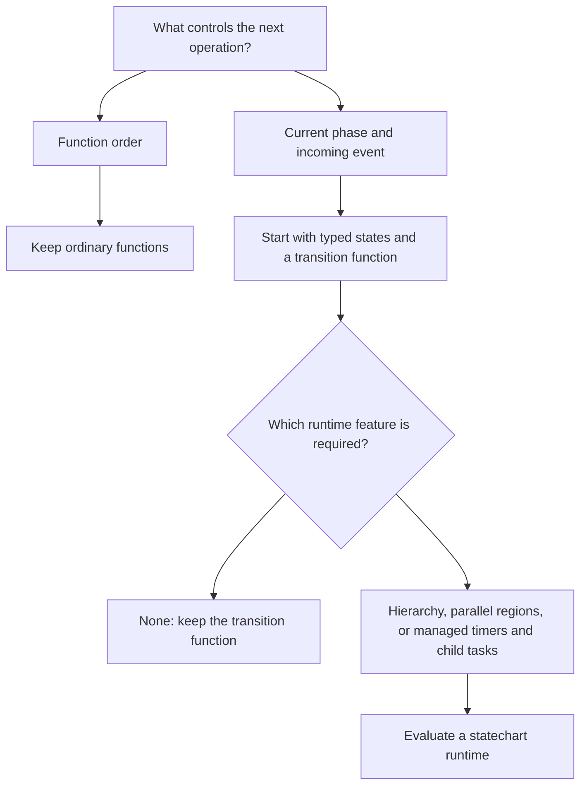

# State Machines

Read this when lifecycle or event order controls legal actions, or when choosing
between ordinary functions, a transition function, and a statechart runtime.

Choose the smallest model that makes legal behaviour explicit. Name the
requirement that a larger model satisfies before adopting it.

Consecutive function calls do not need named lifecycle states. A script that
reads, transforms, writes, and exits stays a pipeline. Calculations and job
selection remain functions, even when a machine manages their execution.

A state machine earns its place when the same event has different legal
outcomes in different phases. Start with a typed union and a pure transition
function. Consider a library when its hierarchy, parallel regions, timers, or
task lifetimes remove machinery the application otherwise has to maintain.
External events alone do not require a library. Select the model before the
library; language-specific skills own API recipes.

## Scope The Model

Model one entity or workflow per lifecycle. Keep independent concerns separate;
combining them multiplies states. Parallel statechart regions describe
independent modes within one lifecycle; separate owners need separate models.

Name states after behaviour modes. Keep quantities and identifiers in context;
put data required only in one phase in that phase's typed variant. A factory's
production lifecycle does not enumerate every cash or inventory value. A
worker's job-scoring function chooses work; its machine manages travel, work,
and interruption. An agent's model proposes actions; its lifecycle admits them.

## Make Transitions Authoritative

Apply the functional-core/imperative-shell rule to transitions: return the next
state and commands describing work. The shell performs that work and supplies
outcomes as events. Route lifecycle changes through the transition boundary.

Define invalid-event behaviour explicitly: reject a requested action, ignore an
obsolete result, or record it for reconciliation. Correlate asynchronous results
with the operation or revision they belong to. Approval authorises an exact
revision; an edit invalidates it. Cancellation stops admitting new work but
cannot undo an external action already accepted.

## Separate Runtime Guarantees

A transition table specifies legal behaviour. It does not itself provide
persistence, concurrent-writer coordination, or atomic external effects. Name
the owner of state and the guarantees required across restarts. Use
`references/workflows-transactions.md` for the transactional design; snapshot
restoration alone does not establish safe recovery of unfinished effects.

Test event sequences through the public transition boundary. Include stale and
duplicate results, cancellation races, retry limits, and terminal states.
Test the chosen runtime separately for timers, task interruption, and recovery.
Record transitions and rejected events using the observability guidance.
