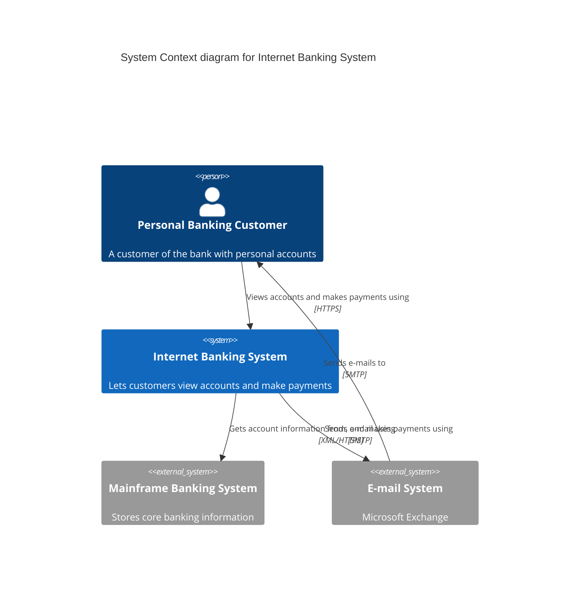
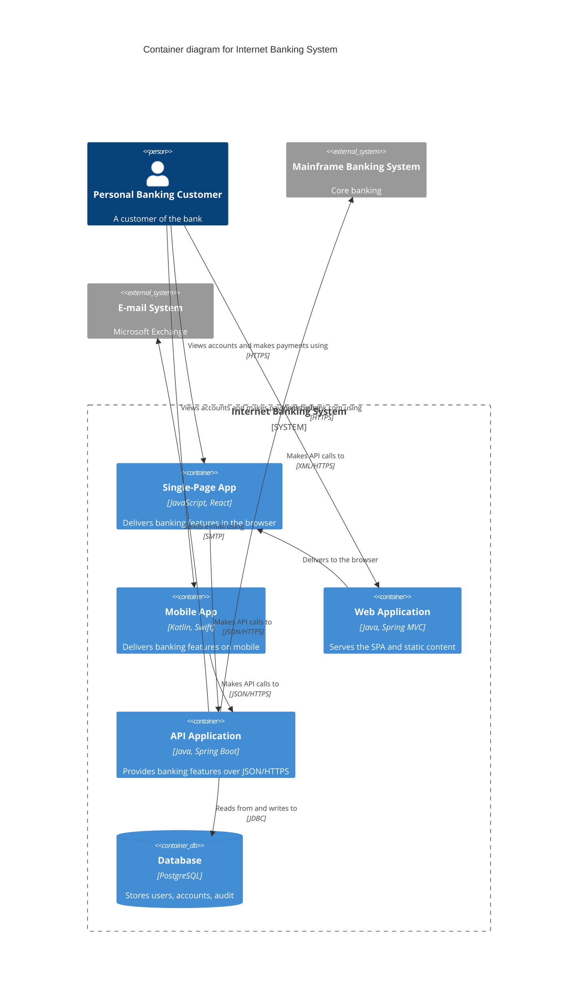

# Mermaid C4 (default format)

Mermaid is the **default** because a fenced ` ```mermaid ` block **renders inline
on GitHub, GitLab, VS Code, Obsidian and most markdown viewers with zero
toolchain** - ideal when the output lands in a README or PR. Its syntax is
PlantUML-compatible and well-represented in training data, so it's easy to get
right.

**Caveats (know these before choosing Mermaid):**

- **Officially experimental** - the docs warn syntax may change.
- **Weak layout** - no real layout algorithm; position is driven by
  **statement order** and `UpdateLayoutConfig($c4ShapeInRow, $c4BoundaryInRow)`.
  Directional `Lay_U/D/L/R` hints are **not supported**. Sprites, tags, links,
  and legends are unfinished.
- Therefore: **keep diagrams small-to-medium.** For a large multi-level model or
  fine layout control, switch to Structurizr DSL or C4-PlantUML
  ([structurizr-dsl.md](structurizr-dsl.md)).

Reference: [mermaid.js.org/syntax/c4.html](https://mermaid.js.org/syntax/c4.html).

## Chart types

`C4Context`, `C4Container`, `C4Component`, `C4Dynamic`, `C4Deployment`. One chart
type per diagram (this enforces "one abstraction level per diagram").

## Elements

```text
Person(alias, "Label", "Optional description")
Person_Ext(alias, "Label", "Description")

System(alias, "Label", "Description")
System_Ext(alias, "Label", "Description")
SystemDb(alias, "Label", "Description")
SystemQueue(alias, "Label", "Description")

Container(alias, "Label", "Technology", "Description")
ContainerDb(alias, "Label", "Technology", "Description")
ContainerQueue(alias, "Label", "Technology", "Description")
Container_Ext(alias, "Label", "Technology", "Description")

Component(alias, "Label", "Technology", "Description")
ComponentDb(alias, "Label", "Technology", "Description")
```

Boundaries group same-level elements:

```text
Enterprise_Boundary(alias, "Label") { ... }
System_Boundary(alias, "Label") { ... }
Container_Boundary(alias, "Label") { ... }
Boundary(alias, "Label", "type") { ... }
```

## Relationships

```text
Rel(from, to, "Label", "Optional technology/protocol")
BiRel(a, b, "Label", "Protocol")
Rel_Up / Rel_Down / Rel_Left / Rel_Right   %% hints; honoured weakly
```

Always give a specific verb-phrase label; put the protocol in the tech slot on
inter-container relationships.

## Layout tuning

```text
UpdateLayoutConfig($c4ShapeInRow="3", $c4BoundaryInRow="1")
```

Controls wrapping only. To change placement, reorder the statements.

## Worked example - System Context

````markdown

````

## Worked example - Container

````markdown

````

Note every container carries a technology, every relationship a specific label,
inter-container hops name a protocol, and the boundary keeps it to one level.

## Rendering

- **Best path:** paste the fenced block into the README/PR/issue - GitHub renders
  it, no tooling. This is the whole point of choosing Mermaid.
- **Standalone image:** `scripts/render.sh diagram.mmd` -> uses `mmdc`
  (`@mermaid-js/mermaid-cli`) if installed, else `pnpm dlx @mermaid-js/mermaid-cli`
  (pulls headless Chromium on first run).
- Always render and read errors before presenting. Common gotchas: a stray
  comma, a missing quote, or `Rel` referencing an undefined alias.
